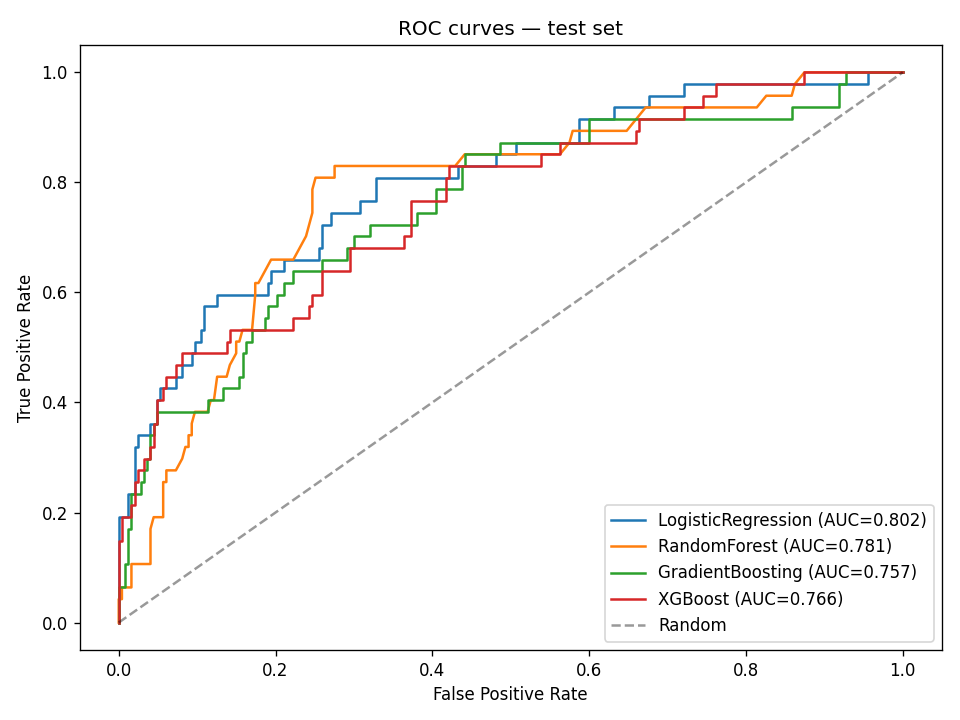
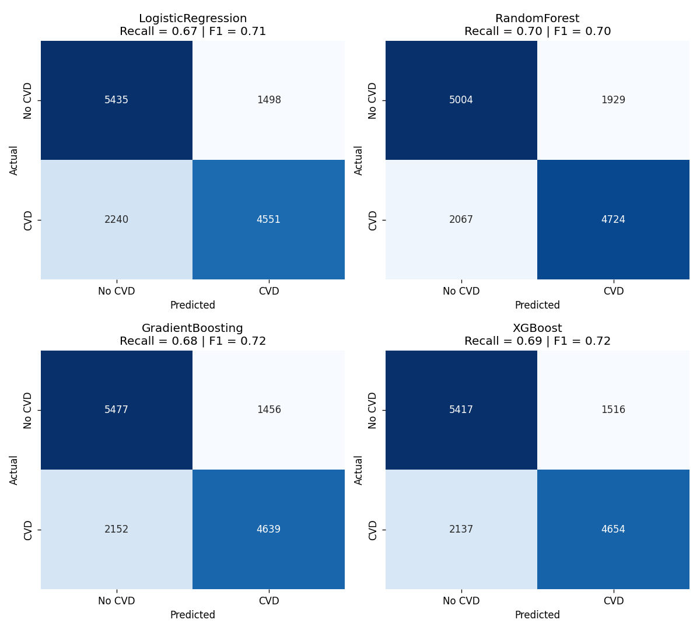
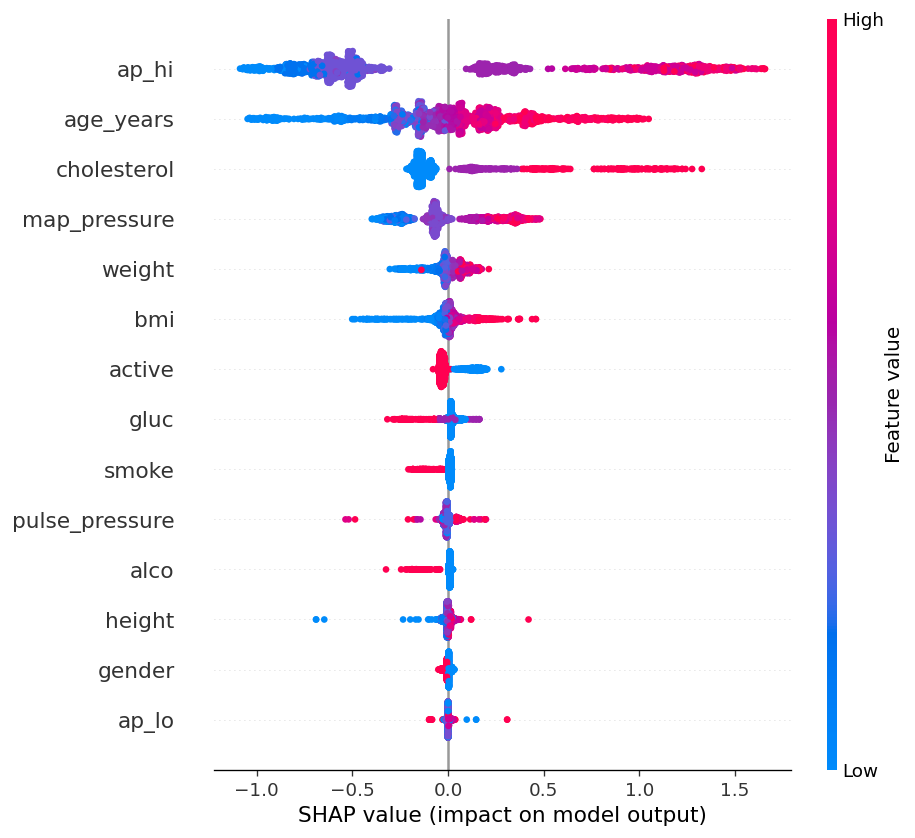

# Cardiovascular Disease Risk Prediction — End-to-End MLOps Pipeline

A production-style machine-learning system that predicts a patient's cardiovascular disease (CVD) risk from routine clinical measurements, served through a FastAPI backend and an HR-friendly Streamlit dashboard with AI-generated prevention tips.

> ⚠️ **Disclaimer:** This project is for educational and portfolio purposes only. It is not a medical device and must not be used for clinical decision-making.

---

## Problem

Cardiovascular disease is the leading cause of death globally. Early identification of at-risk patients enables preventive intervention — lifestyle counselling, BP monitoring, lipid management — which has been shown to meaningfully reduce CVD events.

This project builds a complete ML system that:
1. Trains a model on 70,000 patient records
2. Exposes the model through a REST API
3. Provides a clinician-friendly dashboard
4. Generates personalised prevention advice via an LLM (Google Gemini)

---

## Architecture

```
Raw CSV (Kaggle cardio dataset)
        │
        ▼
[Data Validation & Cleaning]   src/data_cleaning.py
        │
        ▼
[Feature Engineering]          src/feature_engineering.py
   (age_years, BMI, pulse pressure, MAP)
        │
        ▼
[Preprocessing & Split]        src/data_transformation.py
   (StandardScaler, stratified 80/20)
        │
        ▼
[Model Training]               src/model_training.py
   (LogReg, RF, GBM, XGBoost — 5-fold CV)
        │
        ▼
[Model Evaluation]             src/model_evaluation.py
   (picks winner by ROC-AUC)
        │
        ▼
[Explainability]               src/shap_analysis.py
   (SHAP summary + per-patient waterfalls)
        │
        ▼
[FastAPI Backend]              api/main.py
   (POST /predict, GET /health)
        │
        ▼
[Streamlit Dashboard]          dashboard/app.py
   (form + charts + Gemini tips)
```

---

## Tech Stack

| Layer | Tools |
|---|---|
| Data | pandas, numpy |
| ML | scikit-learn, XGBoost |
| Explainability | SHAP |
| Backend | FastAPI, Uvicorn, Pydantic |
| Frontend | Streamlit |
| GenAI | Google Gemini (gemini-2.5-flash) |
| Serialization | joblib |
| Visualisation | matplotlib, seaborn |

---

## Project Structure

```
cvd-risk-prediction-system/
├── data/
│   └── cardio_data.csv          # raw Kaggle dataset (~70K rows)
├── notebooks/
│   └── eda.ipynb                # exploratory analysis + visualisations
├── src/
│   ├── data_cleaning.py         # range/logic validation, drop bad rows
│   ├── feature_engineering.py   # age_years, BMI, pulse pressure, MAP
│   ├── data_transformation.py   # scaling, stratified split
│   ├── model_training.py        # 4 models with 5-fold CV
│   ├── model_evaluation.py      # metrics, confusion matrices, ROC curves
│   └── shap_analysis.py         # global + per-patient explanations
├── api/
│   └── main.py                  # FastAPI app
├── dashboard/
│   └── app.py                   # Streamlit app
├── reports/                     # generated charts + metrics CSV
├── models/                      # generated joblib files (gitignored)
├── requirements.txt
├── .env.example
└── README.md
```

---

## Quick Start

### 1. Clone and set up environment
```bash
git clone https://github.com/Amandhi17/cvd-risk-prediction-system.git
cd cvd-risk-prediction-system
python -m venv venv
.\venv\Scripts\Activate.ps1     # Windows
# source venv/bin/activate      # macOS / Linux
python -m pip install -r requirements.txt
```

### 2. (Optional) Add a free Gemini API key for prevention tips
```bash
cp .env.example .env
# Open .env and paste a key from https://aistudio.google.com/apikey
```

### 3. Run the pipeline
```bash
python src/data_cleaning.py
python src/feature_engineering.py
python src/data_transformation.py
python src/model_training.py
python src/model_evaluation.py
python src/shap_analysis.py
```

### 4. Start the API and dashboard (two terminals)
```bash
# Terminal 1
uvicorn api.main:app --reload --port 8000

# Terminal 2
streamlit run dashboard/app.py
```

Open http://localhost:8501 for the dashboard, or http://localhost:8000/docs for the API.

---

## Results

### Model comparison (held-out test set, 13,724 patients)

| Model | Accuracy | Precision | Recall | F1 | ROC-AUC |
|---|---|---|---|---|---|
| Logistic Regression | 0.728 | 0.752 | 0.670 | 0.709 | 0.791 |
| Random Forest | 0.709 | 0.710 | 0.696 | 0.703 | 0.771 |
| **Gradient Boosting** | **0.737** | **0.761** | 0.683 | **0.720** | **0.802** |
| XGBoost | 0.734 | 0.754 | 0.685 | 0.718 | 0.799 |

**Winner: Gradient Boosting** by ROC-AUC. All four models cluster around 0.77–0.80, suggesting the dataset's signal ceiling.

### ROC curves


### Confusion matrices


### Explainability (SHAP)

Top 5 risk drivers identified by the model:

| Feature | Mean |SHAP| |
|---|---|
| `ap_hi` (systolic BP) | 0.726 |
| `age_years` | 0.276 |
| `cholesterol` | 0.217 |
| `map_pressure` (engineered) | 0.185 |
| `weight` | 0.057 |

All five align with established cardiology knowledge, and the engineered `map_pressure` ranking in the top 4 validates the feature-engineering choices.



Per-patient explanations are also generated — see `reports/shap_high_risk.png` and `reports/shap_low_risk.png`.

---

## Design Decisions & Trade-offs

These were deliberate choices made during the project — useful talking points for review/interview.

### Why these 4 models?
- **Logistic Regression**: linear baseline. If a complex model can't beat it, the complexity isn't justified.
- **Random Forest**: robust, handles non-linearity, immune to multicollinearity.
- **Gradient Boosting**: sequential learning, usually beats RF on tabular data.
- **XGBoost**: regularised + production-grade.

Together they span the model space: linear vs non-linear, bagging vs boosting, plain vs regularised.

### Why pick the winner by ROC-AUC, not accuracy?
ROC-AUC measures how well the model **ranks** positives above negatives across all thresholds — threshold-independent quality. Accuracy alone would have been misleading even on this balanced dataset because it ignores how confident the model is.

### Why use SHAP?
Probability scores aren't actionable in a clinical context. SHAP attributes each prediction to specific risk factors ("+0.18 from high systolic BP, −0.04 from being physically active"), turning the black-box model into a decision-support tool.

### Why no class-weight handling?
Earlier iterations on a different dataset (employee attrition, 84/16 imbalance) used `class_weight='balanced'` and SMOTE — both were carefully compared. For the cardio dataset the target is ~50/50, so no rebalancing was needed.

### Why combine ML + LLM?
**Predictive AI tells you WHAT will happen. Generative AI tells you WHAT TO DO about it.** The XGBoost/GBM model outputs a probability; Gemini translates that probability + the patient profile into concrete prevention recommendations a clinician or patient can act on.

---

## Known Limitations

These are explicitly documented because acknowledging them is part of responsible ML engineering.

1. **Smoking signal is weak/inverted in this dataset.** Sanity-testing shows that toggling `smoke` from No → Yes slightly *lowers* the predicted risk. This is a documented artefact of the Kaggle cardio dataset — likely due to self-reporting bias, survivor bias (older heavy smokers are missing from the screened population), and the lack of intensity (binary instead of cigarettes/day). The model is faithfully reflecting the data; the data has a limitation.
2. **Performance ceiling around 0.80 ROC-AUC.** This dataset cannot reach >0.90 because it lacks important predictors: family history, genetic markers, ECG/echocardiogram data, prior cardiovascular events, medication history.
3. **Not a medical device.** No regulatory approval. No clinical validation. Educational use only.

---

## Skills Demonstrated

- **Data engineering**: validation pipelines, range/logic checks, reproducible preprocessing
- **Machine learning**: classification, CV, hyperparameter awareness, metric selection
- **Feature engineering**: domain-informed derived features (BMI, MAP, pulse pressure)
- **Explainability**: SHAP TreeExplainer, global + local explanations
- **MLOps**: model serialisation, deterministic pipelines, separated concerns (clean/feature/transform/train/eval)
- **API design**: REST endpoints, request validation with Pydantic, auto-generated docs
- **Frontend**: Streamlit forms, dynamic feedback, multi-tab layout
- **GenAI integration**: prompt engineering, LLM-augmented predictions
- **Project structure**: clean folder layout, `.env` secrets management, gitignored artefacts
- **Critical thinking**: documented dataset limitations and model trade-offs

---

## Dataset

[Cardiovascular Disease Dataset](https://www.kaggle.com/datasets/sulianova/cardiovascular-disease-dataset) by Svetlana Ulianova on Kaggle.
~70,000 patient records, 11 features, binary target.

---

## Author

**Amandhi Siriwardena**
Portfolio: [github.com/Amandhi17](https://github.com/Amandhi17)
